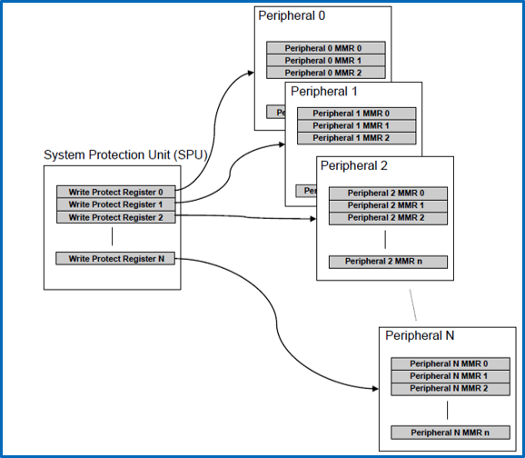
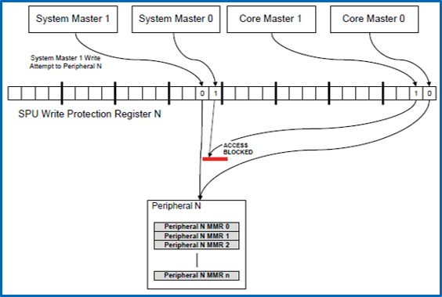
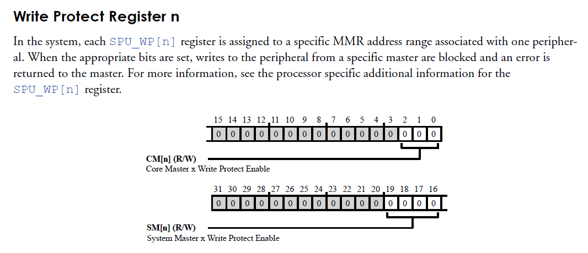
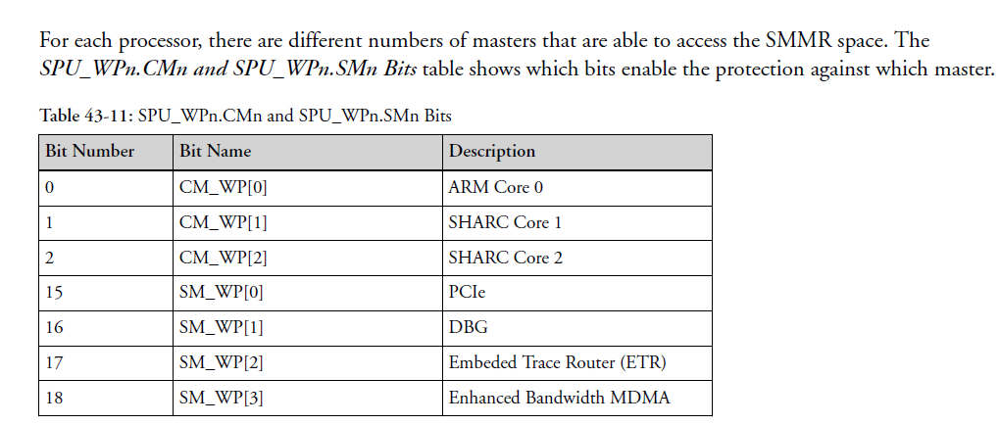

System Protection Unit (SPU)
============================

Introduction
------------

This page describes the System Protection Unit (SPU) on ADSP-SC5xx platforms, which is responsible for controlling access to shared system resources (peripherals, DMA, memory, etc) by different system bus masters (Arm core, SHARC cores, MDMA).

The information contained in this page is from the `ADSP-SC5xx Hardware Reference Manual <https://www.analog.com/media/en/dsp-documentation/processor-manuals/SC58x-2158x-hrm.pdf>`_, Chapter 43.

Overview
--------

The SPU protects a system from multiple bus masters from causing conflicts over peripherals, and keeps access to system components fixed to particular bus masters.
It does this in 2 ways:
- Write-Protect access to certain Memory-Mapped Registers (MMRs) against selected bus masters.
- Global Lock Mechanism to simultaneously & dynamically protect many peripheral configuration registers.
- Exception Signal to indicate blocked accesses

In addition, a user can configure access protection for the SPU's own write-protection registers.

The SPU is a critical configuration resource for systems which intend to leverage peripherals via the SHARC cores. Proper Configuration of the SPU should generate an SPU exception when a core (Arm or SHARC) tries to access a peripheral that has already been allocated to a different core.

Write-Protect Configuration
---------------------------

The configuration of the SPU's Write Protection roughly begins with setting the Write Protect register corresponding to the peripheral to protect.

Each of these registers protects a particular peripheral from write accesses by certain bus masters:

The Write Protect Registers are all formatted the same:

These registers each have bitfields which correspond to system bus masters which should be prevented from writing the peripheral.

Current Linux Support Status
----------------------------

Currently, the DSP Linux kernel has support instrumented within the various peripheral drivers for the SPU.

The drivers call back to functions defined in arch/arm/mach-sc5xx/spu.c.

.. code-block:: c

     #include <linux/export.h>
     #include <linux/types.h>

     void set_spu_securep_msec(uint16_t n, bool msec)
     {
       (void)n;
       (void)msec;
     }
     EXPORT_SYMBOL(set_spu_securep_msec);

Currently, these functions are stubs which do not actually configure the SPU. The ADI DSP Linux kernel and accompanying examples are designed with the intent that the ARM core owns and allocates most of the system's peripherals.
The accompanying SHARC examples leverage peripherals minimally to prevent contention with the ARM for system resources.

In the current state, it is advised to implement SPU protections to allow the system to operate reliably. For systems where the ARM core owns and uses most peripherals, the SPU driver can be used as a starting point.
For systems where the SHARC cores are intended to own many system resources, the SHARC cores should instrument their own SPU configuration and carefully modify the ARM Linux kernel and devicetree to remove peripheral usage from the Linux image and prevent resource contention.
